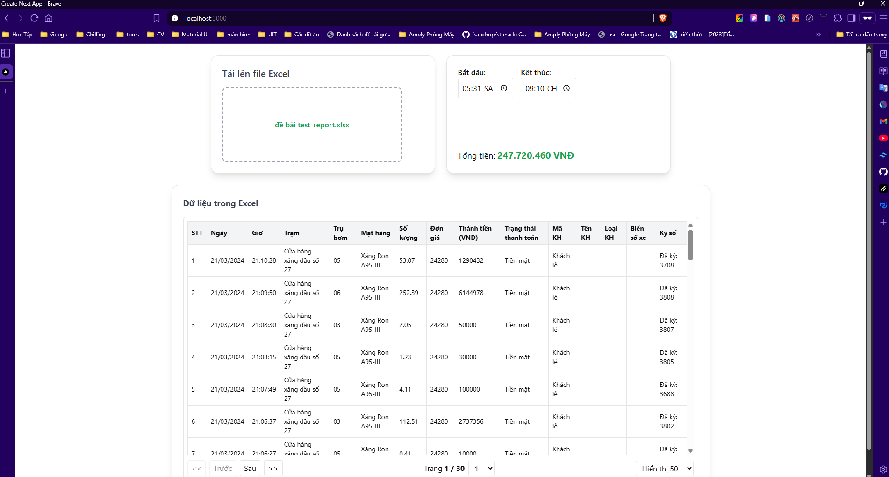

# Task 1 - Data Table & Utilities

### Giới thiệu
Task này được xây dựng bằng **Next.js 14 + React**, sử dụng **TailwindCSS** và các **shacdnUI** để hiển thị dữ liệu dưới dạng bảng, upload file Excel và hỗ trợ các chức năng lọc thời gian, định dạng tiền tệ.

---

### Cấu trúc thư mục
```
task_1
├── app
│ ├── _components
│ │ ├── DataTable.jsx # Bảng hiển thị dữ liệu
│ │ ├── FileDrop.jsx # Kéo/thả file upload
│ │ ├── TimeFilter.jsx # Bộ lọc theo thời gian
│ │ ├── UploadExcel.js # Xử lý file Excel
│ │
│ ├── _utils
│ │ └── FormatCurrency.js # Hàm định dạng tiền tệ
│ │
│ ├── fonts
│ ├── favicon.ico
│ ├── globals.css # CSS toàn cục
│ ├── layout.js # Layout chính
│ └── page.js # Trang hiển thị chính
│
├── components
│ └── ui
│ ├── button.jsx # Nút bấm tái sử dụng
│ └── table.jsx # Bảng tái sử dụng
│
├── lib
│ └── utils.js
│
├── node_modules
├── .eslintrc.json
├── .gitignore
├── .prettierignore
├── .prettierrc.json
├── components.json
├── jsconfig.json
├── next.config.mjs
├── package-lock.json
├── package.json
├── postcss.config.mjs
├── tailwind.config.js
└── README.md
```


### Cài đặt dependencies
```
npm install
```

### Chạy development server
```
npm run dev
```

### Ảnh demo:

