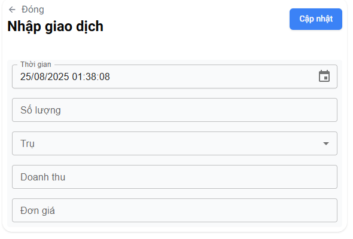
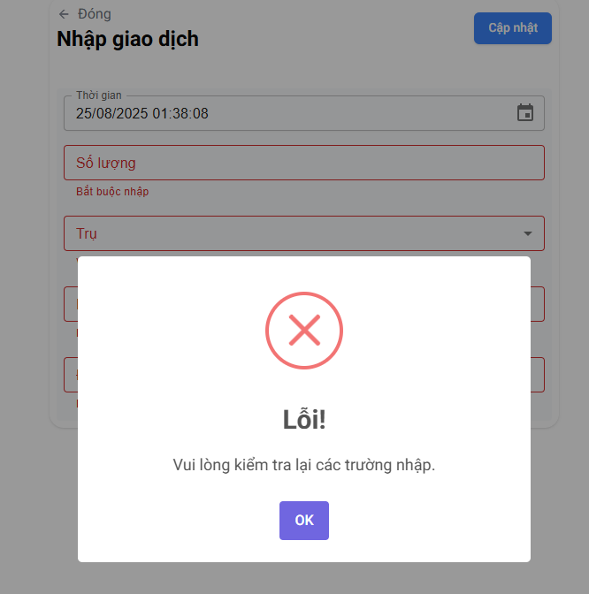
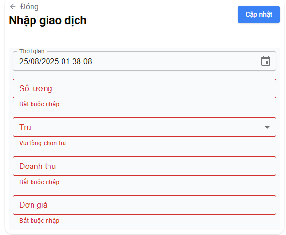
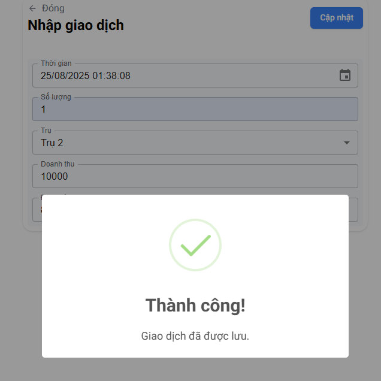

# Task 2 - Form giao dịch

## Giới thiệu
Task này được xây dựng bằng **Next.js + React** và **TailwindCSS**, tập trung vào việc nhập và hiển thị dữ liệu giao dịch (transaction).  
Ngoài ra dự task còn quản lý dữ liệu **pumpData.json** trong thư mục `public`.

---

## Cấu trúc thư mục

```
task_2
├── app
│ ├── _components
│ │ ├── CustomField.jsx # Input field tuỳ chỉnh
│ │ ├── PumpField.jsx # Trường chọn dữ liệu trụ bơm
│ │ ├── TimeField.jsx # Trường nhập thời gian
│ │ └── TransactionForm.jsx # Form nhập giao dịch chính
│ │
│ ├── fonts
│ ├── favicon.ico
│ ├── globals.css # CSS toàn cục
│ ├── layout.js # Layout chính
│ └── page.js # Trang hiển thị chính
│
├── components
│ └── ui
│ └── ... # Các component UI phụ trợ
│
├── lib
│ └── ... # Các hàm tiện ích
│
├── public
│ └── pumpData.json # Dữ liệu mẫu cho thông tin các trụ bơm
│
├── node_modules
├── .eslintrc.json
├── .gitignore
├── .prettierignore
├── .prettierrc.json
├── components.json
├── jsconfig.json
├── next.config.mjs
├── package-lock.json
├── package.json
├── postcss.config.mjs
├── tailwind.config.js
└── README.md
```


### Cài đặt dependencies
```
npm install
```

### Chạy development server
```
npm run dev
```

### Ảnh demo:



### Khi validate thiếu:

<p align="center">
  
  
</p>

### Khi validate đủ & hợp lệ:
