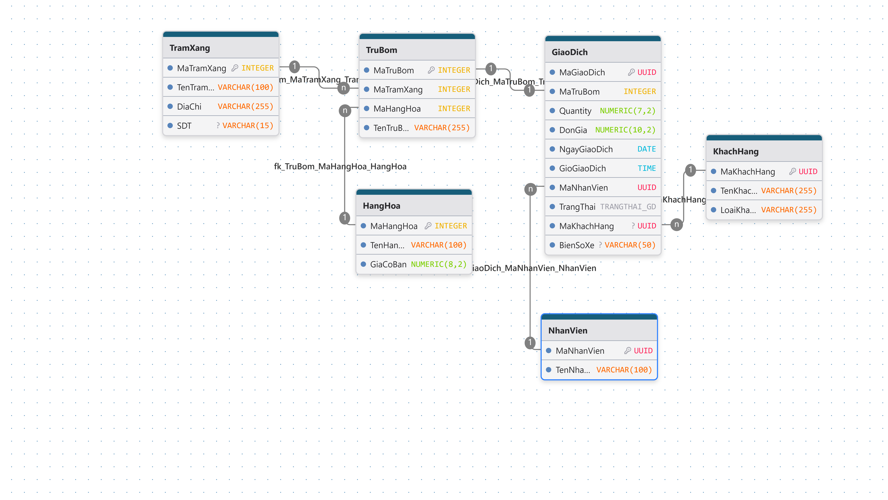
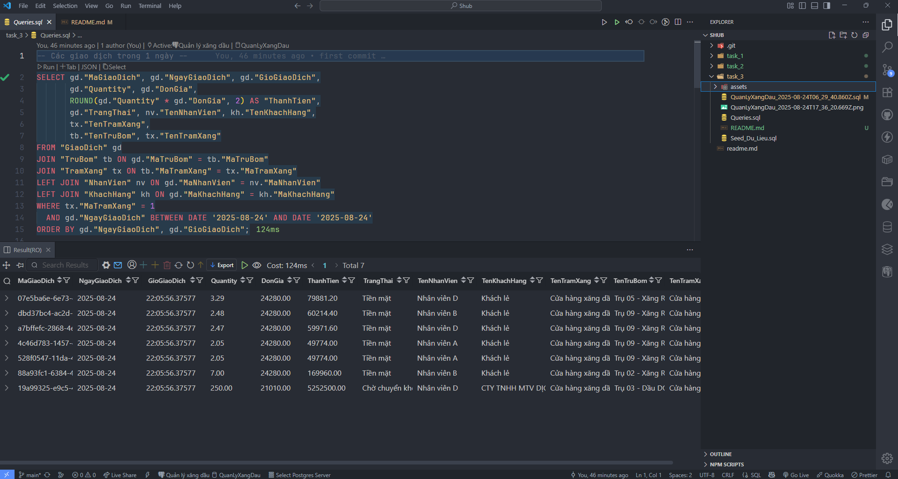
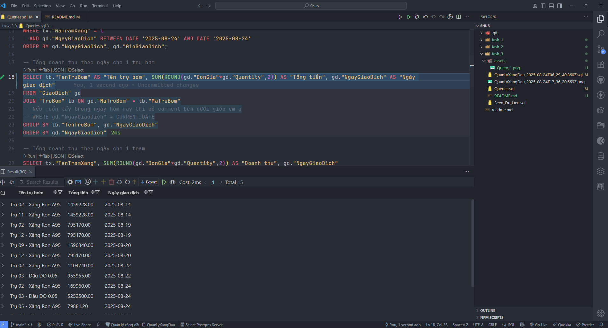
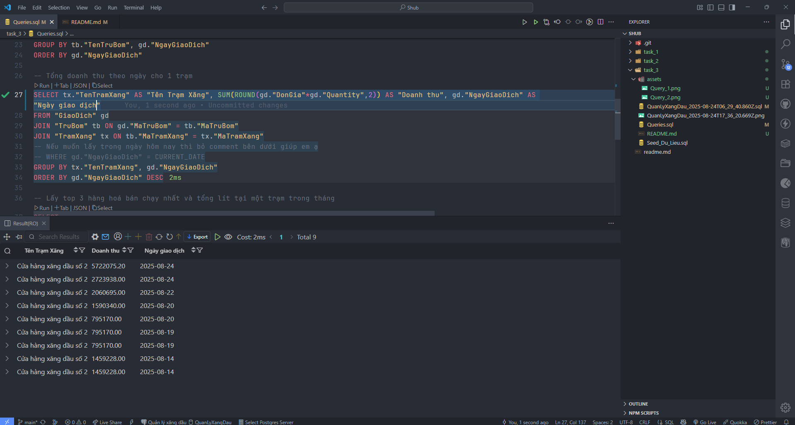
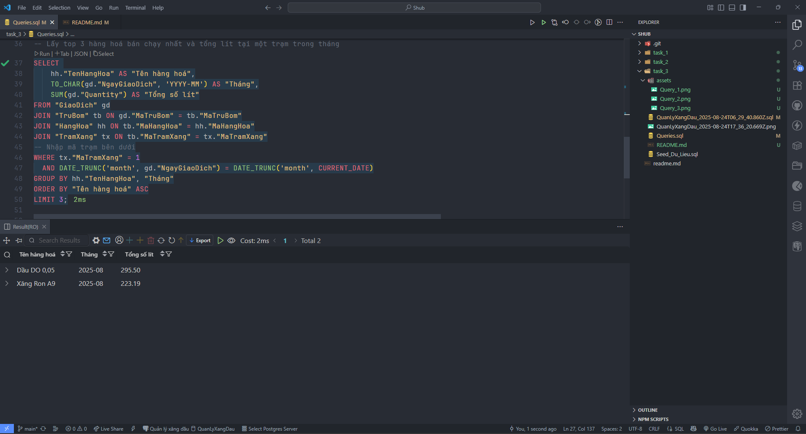

# Task 3 - DATABASE

### Giới thiệu
Task này em chọn **PostgreSQL** phiên bản **17.2.0** để thực hiện cái yêu cầu.

### Cấu trúc thư mục

```
task_3
├── QuanLyXangDau_2025-08-24T06_29_40.860Z.sql # File DDL CSDL
├── QuanLyXangDau_2025-08-24T17_36_20.669Z.png # Ảnh sơ đồ CSDL
├── Queries.sql # Các lệnh truy vấn thống kê
├── Seed_Du_Lieu.sql # Dữ liệu mẫu
└── README.md
```

### Cài đặt:
- Dùng PgAdmin4 để tạo database và tên theo ý của bản thân.
- Vào phần Query và copy toàn bộ trong file **QuanLyXangDau_2025-08-24T06_29_40.860Z.sql** và nhấn **Execute Scripts**
- Dùng file **Seed_Du_Lieu.sql** để tạo dữ liệu mẫu
- File **Queries.sql** là nơi lưu trữ toàn bộ scripts thực hiện yêu cầu của bài **Task 3**

### Ảnh sơ đồ:


### Ảnh demo:

<p align="center">
  
  
</p>

<p align="center">
  
  
</p>