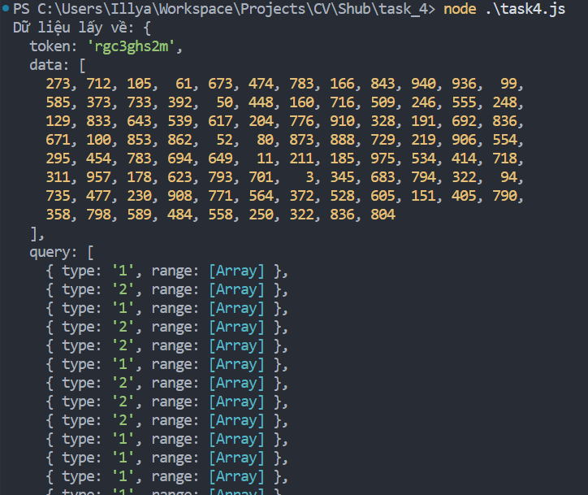
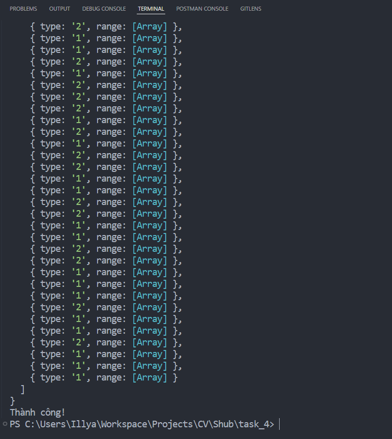

# Task 4 - Data structure & Algorithm

## Giới thiệu
Task này được thực hiện bằng **JavaScript** type **module**.

## Yêu cầu
Sử dụng thuật toán có độ phức tạp **O(n + q)**
(n là độ dài mảng, q là số lượng truy vấn) để đảm bảo hiệu năng xử lý.

## Cách thực hiện

- Dùng thư viện **axios** để thực hiện các phương thức như **GET / POST**
- Lấy dữ liệu input từ API bằng phương thức **GET**.

- Lấy được dữ liệu gồm **token**, mảng **data** và mảng **query**

- Khởi tạo **tongMang** để tính tổng bình thường, còn **tongDoiDau** để tính tổng xen kẽ dấu.

- Tính toán dựa trên điều kiện **type** trong query. Nếu **type** = 1 thì áp dụng **tongMang**, ngược lại thì **tongDoiDau**

- Gửi kết quả về API bằng phương thức POST kèm token trong header Authorization.


### Cài đặt dependencies
```
npm install
```

### Chạy kiểm thử
```
node ./task4.js
```

### Kết quả:

<p align="center">
  
  
</p>